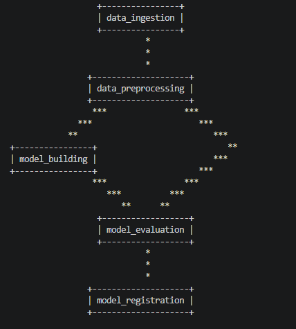

# SATYA : Sentiment Analyser

**Satya** is an end-to-end Machine Learning project designed to analyze sentiments. This repository focuses on the model development, API backend creation, and deployment pipelines using AWS and DevOps best practices.

# Creation of the Satya

## 1. Cookiecutter Template
Using cookiecutter template to create structure. make sure cookiecutter is installed globally.

```bash   
pip install cookiecutter (if not installed)
cookiecutter -c v1 https://github.com/drivendata/cookiecutter-data-science

You've downloaded C:\Users\Vivek\.cookiecutters\cookiecutter-data-science before. Is it okay to delete and re-download it? [y/n] (y): y
    project_name (project_name): satya
    repo_name (satya): satya
    author_name (Your name (or your organization/company/team)): Vivek Kumar
    description (A short description of the project.): Sentiments Analysis ML project to build an end-to-end API.
    Select open_source_license
        1 - MIT
        2 - BSD-3-Clause
        3 - No license file
        Choose from [1/2/3] (1): 3
    s3_bucket ([OPTIONAL] your-bucket-for-syncing-data (do not include 's3://')): buckets/satya-mlflow-bucket
    aws_profile (default): 
    Select python_interpreter
        1 - python3
        2 - python
    Choose from [1/2] (1): 1
```

## 2. Create virtual environment and install libraries
Create/Activate virtual environment using Anaconda/Python and install libraries.

### Open Anaconda Prompt and create environment
```bash
conda create -n bca
conda activate bca
```

### Check for pip, dvc and git and python
> NOTE: git must be on the global system while the rest including dvc must be env specific. if not install then install.
```bash
conda install pip
pip install dvc
python --version
git --version
pip install -r requirements.txt
```

## 3. create git repo

make new repo using github website > name > description > create repository and copy the url like https://github.com/mrvivekkumar7171/satya.git for repo name satya

```bash
git init
git remote add origin https://github.com/mrvivekkumar7171/satya.git
git status # show all the files/folders we have
git add .
git commit -m "Initial Commit"
git push origin master # pushing the local repo files to github
```

## 4. Data collection
We have used social media data from Twitter and Reddit because it is close to Youtube for sentiment analysis. [Twitter and Reddit Sentiment Analysis Dataset](https://www.kaggle.com/datasets/cosmos98/twitter-and-reddit-sentimental-analysis-dataset) has two columns comments and sentiment. The sentiment column has three values -1, 0, 1 for negative, neutral and positive sentiments respectively. The problem comes under multi-class classification.

## 5. Data Preprocessing
The dataset has missing values labelled as neutral, duplicates and empty comments, so we removed these rows. Then we perform preprocessing steps like lower casing, removing urls, replaced new line characters with space etc. 

## 6. EDA
- Our dataset is imbalanced with 22% negative, 35% neutral and 43% positive.
- The average number of words in each comment is 30 and median is just 13. The high difference between median and mean shows that there is outliers in our data. Also, minimum number of words is 1 and maximum number of words is 1300.
- The word count is highly right skewed. Most of words are in the range of 1 to 200 while there are few comments with more than 200 to 1200 words.
- Neutral comments are generally shorter than positive and negative comments. While positive and negative comments have same distribution.
- Positive comments have highest outliers with long comments in comparision to negative comments.
- There are very large number of comments where there is very small numbers of stop words and less comments with high numbers of stop words. Thus neutral comments have mostly less numbers of stop words.
- Again, stop words count of positive is highest while neutral is lowest. Negative comments have slightly less stop words than positive comments.
- Top 25 Most Common Stop Words

- number of punctuattion is 0 for all means punctuation is already removed.
- Removing non-english characters like emojis, Hindi and other language characters.
- Bigrams (Divided data set into set of 2 words each)

- Trigrams (Divided data set into set of 3 words each)

- Remove stop words while retaining essential ones ('not', 'but', 'however', 'no', 'yet') because stopwords like 'the' are not useful in sentiment analysis.
- Apply lemmatization to reduce words to their base form. For example, 'running' becomes 'run', 'better' becomes 'good', etc. This helps in reducing the dimensionality.
- We can notice there is more words related to politics means our data is more inclined towards politics and that is problem and the data will not perform well on non-political youtube video. We also plotted WordCloud for each sentiment and result are same and that is most are political words.


- Plotting graph of words used in positve, neutral and negative context. We can notice that not and other words are used in positve context more than neutral and negative context as we have more positive comments


## 7. MLflow Experiment Tracking Server Setup

For collaborative projects, logging to a centralized server is crucial. We install MLflow on an EC2 instance and store code/plots on S3.

### Steps to setup a **Mlflow Tracking Server**

1. visit https://aws.amazon.com/ then Sign in to console then sign in using root user email then enter email id and password and OTP.

2. Create EC2 instance : 

- EC2 > Launch instances > name it (satya-mlflow-EC2) > select OS (Ubuntu) > select t2.micro > select key pair (if not then create) (satya_key_pair) > allow http and https traffic > select storage 8 gb > then click launch > save the region of the EC2 to AWS_REGION inside .env.

3. To run the below command: 

- EC2 > instances > Instance ID > connect > connect.

```bash
sudo apt-get update # to update the package manager
sudo apt-get install python3 python3-venv python3-pip -y # installing python, virtual environment and pip
python3 -m venv mlflow_env # creating a new virtual environment
source mlflow_env/bin/activate # starting the virtual environment
pip install mlflow boto3 # installing libraries
pip list # checking mlflow in the list
```

4. Create S3 bucket : 

- S3 > Create bucket > name it (satya-mlflow-bucket) > click Create bucket

5. To enable communication between EC2 and S3 Bucket (Setup IAM Role) : 

- IAM > role > Create role > Select AWS Service in Trusted entity type > Select EC2 in the Use Case > next > then search and select AmazonS3FullAccess > next > name the role name (EC2-MLflow-S3-Access) > create role.

6. Update the IAM role on the EC2: 

- EC2 > instance > select satya-mlflow-EC2 and security on Action menu > Modify IAM role > select EC2-MLflow-S3-Access > update IAM role.

7. To run the mlflow on the EC2 instance endlessly using screen: 

```bash
sudo apt-get install screen -y
screen -S mlflow
mlflow server --backend-store-uri ./mlruns --default-artifact-root s3://satya-mlflow-bucket --host 0.0.0.0 --port 5000
```

8. Setup security group to allow the EC2 5000 port public access : 

- EC2 > instances ID > Security > click on Security group (launch-wizard-1) > Inbound rules > Edit inbound rules > Add rules > fill custom TCP as Type and fill port range (5000) and port address (0.0.0.0/0) > Save Rules.

9. To verify the mlflow is working : 

- click EC2 > instances > copy Public IPv4 address (15.206.149.208) > open http://65.2.37.109:5000/ on browser.

10. To log the model and metrics just save the url to the .env for local and secrets in google colab file satya_mlflow_ec2_uri = http://65.2.37.109:5000/.

11. To enable jupyter notebook to connect with S3 and store the artifact to the S3 (Create User in IAM): 

- IAM > users > Create user > enter name (satya-user-iam) > next > select Attach policies directly > AdministratorAccess in the Permissions policies > next > Create user 

12. To get  the credentials : 

- IAM > users > satya-user-iam > Create access key > Command Line Interface (CLI) > select i understand > next > Creaate > save the credentials to the .env for local and secrets in google colab under AWS_SECRET_ACCESS_KEY and AWS_ACCESS_KEY_ID and press Done.

13. If stopped the EC2 then to start : 

- EC2 > instance > click on instance id > connect > connect.

```bash
source mlflow_env/bin/activate # to run mlflow with the help to screen to run endlessly, automatically run the mlflow with restart
sudo apt-get install screen -y # starting the mlflow with the help of screen
screen -S mlflow
mlflow server --backend-store-uri ./mlruns --default-artifact-root s3://satya-mlflow-bucket --host 0.0.0.0 --port 5000
```

## 8. Base Model building and Experimentation and Evaluation
All experiments were carried out in Google Colab due to local hardware restrictions.

### Baseline Model
Using stratify parameter of train test split to ensure that the training and testing subsets maintain the exact same proportion of class labels as the original dataset. We perform preprocessing and applied CountVectorizer/Bag of Words (BoW) with max_features=10000, n_estimators = 200 and max_depth = 15 then training RandomForestClassifier. We got an accuracy of **65%** but due to **imbalanced dataset the result is not reliable**. We have recall (Recall measures how many of the actual `-1` samples your model successfully identified as `-1`) of 0.01 for negative sentiment which means our model is not working well for negative sentiment. So, we need to deal with class imbalance (using overweight/underweight/class_weight).

### Vectorizers (Bow vs TFIDF)
Train RandomForestClassifier with unigrams, bigrams and trigrams. **tfidf with the tri-gram** is giving the best result i.e. recall and accuracy is high but precision is high but not compared to other combination. But, our targets was recall and accuracy so continuing with tfidf with the tri-gram.

### max_features from 1000 to 10000
Training RandomForestClassifier with n_estimators=200, max_depth=15, TfidfVectorizer and Trigram. 10000 as max_features is giving the best result.

### Handling Imbalance
Training RandomForestClassifier with n_estimators=200, max_depth=15 with different techniques to handle class imbalance like `ADASYN`, `Class Weight` balance, `Undersampling`, OverSampling like `SMOTE` and `SMOTE + ENN`. On concluding the result from mlflow, **smote** is perfroming the best.

### Trying different ML models with Hyperparameter Tunning
No Remapping is done since unless specified. Remove rows where the target labels are NaN. Hyperparameter tuning using Optuna direction=maximize for accuracy_score and n_trials=30. TfidfVectorizer with max_features=10000 and Trigram and SMOTE.
Not trying:
  - Gradient Boosting (Generally, XGB and LightGBM perform better than it)
  - Adabost (Generally, XGB and LightGBM perform better than it)
  - Decision Tree (Generally, RF perform better than it)
  - Catboost (all features are not categorical)

#### KNN
We train KNeighborsClassifier with parameters like `n_neighbors` from `1 to 30` and `distance metric (1 for Manhattan, 2 for Euclidean)`. Accuracy optained is `0.59%`.

#### LightGBM
Remap the class labels from [-1, 0, 1] to [2, 0, 1]. We train LGBMClassifier with parameters like `n_estimators` from `50 to 300`, `learning_rate` from `0.0001 to 0.1 on logarithmic scale` and `max_depth` from `3 to 10`. Accuracy optained is `0.84%`.

#### Logistic Regression
We train LogisticRegression with parameters like `C` from `0.0001 to 10 on log scale`, `solver='liblinear'` and `penalty` like `'l1' and 'l2'`. Accuracy optained is `0.78%`.

#### Naive Bayes
We train MultinomialNB with `alpha` from `0.0001 to 1 on log scale`. Accuracy optained is  `0.66%`.

#### Random Forest
We train RandomForestClassifier with `n_estimators` from `50 to 300`, `max_depth` from `3 to 20`, `min_samples_split` from `2 to 20`, and `min_samples_leaf` from `1 to 20`. Accuracy optained is `0.70%`.

#### Support Vector Machine
We train SVC with `C` from `0.0001 to 10 on log scale` and `kernel` like `'linear', 'rbf', 'poly'`. Accuracy optained is `0.83%`.

#### XGBoost
Remap the class labels from [-1, 0, 1] to [2, 0, 1]. We train XGBClassifier with parameters like `n_estimators` from `50 to 300`, `learning_rate` from `0.0001 to 0.1 on logarithmic scale`, `max_depth` from `3 to 10`, `tree_method='hist'` and `device="cuda"` for GPU acceleration. Accuracy optained is `0.48%`.

#### BERT
We achieved an accuracy of 96% on using Deep learning Model (BERT) on test dataset.

#### Stacking Ensemble
Here, Base Learners like `LGBMClassifier` and `LogisticRegression` will make prediction on each comment and then the predictions of both base learners will be passed to the `KNN`, Meta Learner to make the final prediction. We have achived an accuracy of `87%` on test dataset.

#### Word2Vec
Using Word2Vec for vectorization and then train LGBMClassifier. We got 66% accuracy on test dataset with hyperparameter tunning.

#### Custom Features
We have used `spacy` for pos tagging and created features like `Comment Length`, `Word Count`, `Average Word Length`, `Unique Word Count`,  `Lexical Diversity` (unique words in overall words in the comment), `Count of POS Tags` and `Proportion of POS Tags`. Total there are 23 new columns and combined these 23 columns with Vectorizer dataset and trained LGBMClassifier. We have achived 85% accuracy on test dataset.

### Training the best model
Since, LightGBM has given the best accuracy we are going ahead with it. Now, we will perfrom more detailed hyperparameter tunning on LightGBM with 100 trials and parameters like `n_estimators` from `100 to 1000`, `learning_rate` from `0.0001 to 0.1 on log scale`, `max_depth` from `3 to 15`, `num_leaves` from `20 to 150`, `min_child_samples` from `10 to 100`, `colsample_bytree` from `0.5 to 1.0`, `subsample` from `0.5 to 1.0`, `reg_alpha` from `0.0001 to 10 on log scale` (L1 regularization) and `reg_lambda` from `0.0001 to 10 on log scale` (L2 regularization) to find out which hyperparameters are important.

Hyperparameter Importances given by Optuna shows us that most important HP of the algorithm is **learning_rate** then **n_estimators** then **max_depth** while the rest have negligible importance.

Performing the Final Hyperparameter Training on LGBMClassifier with `3 cross validation` and `50 n_trials` with only important HP.

The parameters `objective='multiclass'`, `num_class=3`, `learning_rate` from `0.001 to 0.1`, `n_estimators` from `50 to 500`, `max_depth` from `3 to 20`, `metric="multi_logloss"`, `is_unbalance=True`, `class_weight="balanced"`, `reg_lambda=0.1`, `reg_alpha=0.1`.

After experimentation, we achieved an ML model with **`86% accuracy`** on the test data and and `93%` on train. Our best parameters are  `objective='multiclass'`, `num_class=3`, `learning_rate=0.08`, `n_estimators=367`, `max_depth=20`, `metric="multi_logloss"`, `is_unbalance=True`, `class_weight="balanced"`, `reg_lambda=0.1`, `reg_alpha=0.1`. We will build our project on this model.

## 9. Building a DVC Pipeline

We will take the best model from the Experimentation and build a DVC pipeline on it with remote storage S3. Then we will use dvc pipeline to train the model dynamically and store the training data in model registry.

### Create S3 bucket

- S3 > Create bucket > name it (satya-dvc-bucket) > click Create bucket (make sure Block all public access is on)

### DVC setup
```bash
dvc init
aws configure # Enter IAM details that i had created at the time of mlflow S3 and EC2 setup.

dvc remote add -d myremote s3://satya-dvc-bucket
dvc remote list # To check the remote name

# dvc add data/ # adding data folder in the dvc tracking
# git add data.dvc .gitignore # To track the changes with git
# dvc add models/ # same for models/
# git add .gitignore models.dvc

dvc repro # to run the dvc pipeline through dvc.yaml and params.yaml and use -f to force run all the stages.
dvc dag # to visualize the dvc pipeline

dvc status # To check the DVC status
git status # To check the git status
git add .
git commit -m "comments and comments"

dvc push # to push the your DVC-tracked data to remote server database
git push origin master
```

### Build the dvc pipeline
Below are the 5 stages of the dvc pipeline of the best model from the above experimentation:
1. **Data Ingestion**: Fetch data, perform cleaning, train-test split and store the dataset.
2. **Data Preprocessing**: Perform pre-processing and store the processed dataset.
3. **Model Building**: Apply TFIDF vectorizer and train and store the LightGBM model and vectorizer.
4. **Model Evaluation**: Apply TFIDF vectorizer and test the model on test data and register the parameters, metrics, vectorizer, and model to MLflow Model Registry.
5. **Model Registration**: Register the model for staging.



> NOTE: We can also create a seperate dvc stage for Feature Engineering and apply the TFIDF vectorizer and store the vectorizer and vectorized dataset. Also, we can perform hyperparameter tuning in model building stage, but I have choosen to do hyperparameter tuning  before than apply the best parameter in the model building stage.

We will fetch the model from model registry and use it in the flask API backend to predict the sentiment of the comments.

## 10. Building API and Testing
Building backend using flask & Testing `backend/app.py` using postman.

- put url in new tab : http://localhost:8000/
- select post
- select body then select raw then select json
- fill the body with

```json
    {
        "comments": [
            "This video is great video !",
            "I absolutely hate this video."
        ]
    }
```
- click send to send the http request
- output will be like this

```json
    [
        {
            "comment": "This video is great video !",
            "sentiment": "1"
        },
        {
            "comment": "I absolutely hate this video.",
            "sentiment": "-1"
        }
    ]
```

## 11. Front end Development

### Steps to obtain a YouTube Data API Key:

- **Visit https**: //console.cloud.google.com/
- **Create a Project**: Select a Project dropdown > New Project > name the project ("TheSoftMax.com") > Create
- **Enable YouTube Data API v3**: In left sidebar > APIs & Services > Library > Search for YouTube Data API v3 > click on it > Enable
- **Generate an API Key**: APIs & Services > Credentials > Create Credentials > API Key > Copy the key.

### Building A frontend using Flask
We had build a basic frontend app using Flask to visualize the sentiment of the youtube comments using beautiful visualization of D3.js. Feel free to take help from AI.


## 12. Setting up CI/CD pipeline to make the backend Production ready
*Git commit triggers ci/cd pipeline on github action to automate test, dockerize and deployment model. Inside the ci/cd pipeline, run dvc pipeline that check for change in parameters, if yes then create a new model on MLflow Model Registory and register it at staging. This will update the dvc dependent files on github Actions so Github Action Bot push that using a commit to the github if earlier commit is done by user. Then, load the model and perform loading, signature (number of input and its type), performance testing (compare to current production model or to a benchmark/threshold) using pytest if pass then move the model from staging to production and current production model to archive. Then perform the flask API testing, dockerize the model into an Docker image and Deploy the Docker image.*

*NOTE : No need to run dvc repro on local pc as it will be done automatically on the Github Actions. When you made a commit and did a git push from your PC. So, GitHub Actions will run dvc repro then dvc push then git add . and git commit and git push resulting in a new version of dvc.lock and metrics.json etc. on github website (but not available on your PC), means remote repo has files that are ahead of local repo. Before working and pushing changes to github, we need to pull dvc updataed files from the github cloud to local. Otherwise, this will give error as the commit made by the bot will not be available to the local git repo.*

```bash
git pull # Always Sync With Remote First.
# Make your changes like Modify code, data, pipelines, etc.
git add .
git commit -m "My changes"
git push origin master
```

1. Delete existing `requirements.txt` of cookiecutter and generate one
```bash
pip freeze > requirements.txt
```

2. Create `.GitHub/workflows/cicd.yaml`

3. steps to add AWS credentials to GitHub secrets
- repo > Settings -> Security > Secrets and Variables > Actions > Secrets > New repository secret > fill name and value of the secrets.

4. give permissions to `github-actions[bot]`
- repo > Settings -> Actions -> General -> Workflow permissions -> Read and Write permissions > save

## 13. Dockerization API, Testing and pushing to ECR

To generate separate `backend/requirements.txt` for the docker image to make it light weight by removing unncessary libraries.

```bash
pip install pipreqs
pipreqs . --force # run inside the backend folder to create backend/requirements.txt
```

### Creation of **Docker Hub ECR**:

- Docker Hub > Account Settings > Personal Access Tokens > Generate new token > fill description > Access Permissions > Read, Write, Delete > Generate.

Create Dockerfile and login Docker Profile, build, tag, push, pull and run the Docker Image to and from Docker ECR

```bash
echo "${{ secrets.DOCKERHUB_TOKEN }}" | docker login -u "${{ secrets.DOCKERHUB_USERNAME }}" --password-stdin

# from root folder not from backend folder
docker build -t vivekkumar7171/satya-docker-image:latest . # create and tag as latest
docker push vivekkumar7171/satya-docker-image:latest

docker pull vivekkumar7171/satya-docker-image:latest

# docker need AWS credentials as Docker image of flask backend app fatch model from MLflow Model Registry hosted on AWS EC2 and store artifacts on S3.
docker run -p 80:5000 -e AWS_ACCESS_KEY_ID="${{ secrets.AWS_ACCESS_KEY_ID }}" -e AWS_SECRET_ACCESS_KEY="${{ secrets.AWS_SECRET_ACCESS_KEY }}" vivekkumar7171/satya-docker-image:latest
```

### Creation of **AWS ECR**

- AWS > ECR (Elastic Container Registry) > Private registry > Repositories > Create repository > name it (satya-ecr) > Create > view push commands.

### Create Dockerfile
Login AWS ECR, build, tag, push, pull and run the Docker Image to and from AWS ECR

```bash
aws configure # if not configured

aws ecr get-login-password --region ap-south-1 | docker login --username AWS --password-stdin 794431322868.dkr.ecr.ap-south-1.amazonaws.com # to login AWS ECR

docker build -t satya-docker-image .

docker tag satya-docker-image:latest 794431322868.dkr.ecr.ap-south-1.amazonaws.com/satya-ecr:latest

docker push 794431322868.dkr.ecr.ap-south-1.amazonaws.com/satya-ecr:latest

docker pull 794431322868.dkr.ecr.ap-south-1.amazonaws.com/satya-ecr:latest

docker run -p 80:5000 -e AWS_ACCESS_KEY_ID="secret" -e AWS_SECRET_ACCESS_KEY="secret" 794431322868.dkr.ecr.ap-south-1.amazonaws.com/satya-ecr:latest
```

### [Test the Flask API]:(https://documenter.getpostman.com/view/25678342/2sBYAysomS)

Test the Flask API using postman at http://127.0.0.1:80/predict (same as done in 10. above)

This collection provides a set of endpoints for a YouTube Comments Sentiment Analysis application built with Flask. It allows you to fetch comments from a YouTube video, run sentiment predictions, and visualize the results — all through a locally hosted service.

Ensure the Flask application is running locally on http://localhost:8000 before sending any requests. Use the /health endpoint to confirm the service is up, then use /analyze_video with a YouTube video ID to fetch and analyze comments in one step.


```bash
wsl --shutdown # To shut Docker Terminal/ Docker Engine if unable to shut down.
```

## 14. Deployment using launch template, ASG and Codedeploy of AWS

**ASG (Auto Scaling Group)** in AWS is a feature that automatically manages a group of EC2 instances. It ensures you always have the right number of instances running. It can scale out (add instances) when load increases, and scale in (remove instances) when load decreases. Often paired with a Launch Template (to define how each new instance is built).

**CodeDeploy** integrates with ASG to deploy apps (or Docker images) with different strategy onto EC2 instances. CodeDeploy installs an agent (codedeploy-agent) on each EC2 instance in the ASG. This agent listens for deployment instructions from CodeDeploy. With Docker, CodeDeploy can pull and run new images.

CodeDeploy supports different strategies to roll out changes across your ASG:

- **In-Place Deployment** : Updates the app on existing instances one by one (rolling update). No new instances are created. Some downtime possible if not load-balanced.

- **Blue/Green Deployment** : reates a new set of instances (Green) with the new app version. Shifts traffic from old (Blue) to new (Green). Safer, zero-downtime, easy rollback.

- **Rolling Update (subset at a time)** : Updates a batch of instances, then the next batch, until all are updated. Controlled rollout, avoids full outage. This is commonly used with ASG.

**A Launch Template** is a reusable configuration for launching EC2 instances. Think of it like a blueprint for your servers. Instead of setting up each EC2 manually, you define everything once in a Launch Template, such as: AMI (Amazon Machine Image, i.e. OS + base software), Instance type (e.g., t2.micro, m5.large), Key pair (for SSH access), Security groups (firewall rules), IAM role (permissions for the instance), EBS volumes (disks), User data script (commands to run at boot, e.g. install Docker, pull code, etc.) and Networking details (VPC, subnet) etc.

### Setup Steps
#### Create a new IAM role to enable communication between EC2 - ECR and EC2 - Codedeploy :

- AWS > IAM > roles > create role > Trusted entity type > AWS service > Policy or Use case > EC2 > next > permission policies > select AmazonEC2ContainerRegistryReadOnly and AmazonEC2RoleforAWSCodeDeploy(EC2 access to S3 bucket) > next > name it (Satya_EC2_ECR_IAM_Role_CodeDeploy) > Create role

#### Create launch template for ASG creation and its tell how the each instance in the ASG will be build and run : 

- AWS > EC2 > Launch Template > Create launch Template > name it (SatyaTemplate) > version description (Version 1) > select Auto Scaling guidance > quick star > ubuntu > Instance type > t2 micro > select a key pair (satya_key_pair) > Security groups > default > Advance details > IAM instance profile > select role (Satya_EC2_ECR_IAM_Role_CodeDeploy) > Add the below script at the bottom > create launch template.

```bash script
#!/bin/bash

# Update the package list
sudo apt-get update -y

# Install Ruby (required by the CodeDeploy agent)
sudo apt-get install ruby -y

# Download the CodeDeploy agent installer from the correct region
wget https://aws-codedeploy-ap-southeast-2.s3.ap-southeast-2.amazonaws.com/latest/install

# Make the installer executable
chmod +x ./install

# Install the CodeDeploy agent 
sudo ./install auto

# Start the CodeDeploy agent
sudo service codedeploy-agent start
```

#### Create ASG (auto scaling group) using launch template :

- AWS > EC2 > auto scaling group > name it (Satya_Auto_Scaling_Group) > Launch template > SatyaTemplate > version > Default (1) > next > Availability Zones and subnets > select ap-south-1b and ap-south-1a > next > Attach to a new load balancer > Load balancer name > name it (Satya-Auto-Scaling-Group-ELB) > Load balancer scheme > internet facing > Default routing (forward to) > New target group name > name it (Satya-Target-Group) > select Turn on Elastic Load Balancing health checks > next > Desired capacity > 2 Min desired capacity > 2 > Max desired capacity > 3 > target tracking scaling policy > instance warmup > 300 > select enable group metrics collection within cloudwatch > next > next > Create Auto Scaling group.

#### Varify the ASG creation :

- AWS > EC2 > auto scaling group > click on Satya_Auto_Scaling_Group > activity > list successful EC2 instances launched.

- AWS > EC2 > instances > open each instances > Auto Scaling Group name > Satya_Auto_Scaling_Group

#### To varify the codedeploy agent is installed on each instances.

- run the below command on each instances created by Satya_Auto_Scaling_Group and you will see `active (runing)` in green color. If the terminal not opened then enable public access using ssh by adding `SSH | TCP | 22 | 0.0.0.0/0` instance > security > Security groups > Edit Inbound Rules > fill > save rules. if varified then delete the public access by deleting the records from inbound and save. 

```bash
sudo service codedeploy-agent status
```

#### Create a role to establish communication between codedeploy and ASG

- AWS > IAM > roles > create role > AWS service > CodeDeploy > Next > Next > Role name > CodeDeploy_Service_Role > Create role.

#### Create a new codedeploy application

- aws > CodeDeploy > applications > create application > Application name > `Satya_Application` > Compute platform > Compute platform > create application > create deployment group > Deployment group name > `Satya_Deployment_Group` > Enter a service role > CodeDeploy_Service_Role >  Environment configuration > select Amazon EC2 Auto Scaling groups > Satya_Auto_Scaling_Group > Deployment configuration > CodeDeployDefault.OneAtATime > Load balancer type > select Application Load Balancer or Network Load Balancer > Satya-Target-Group > create deployment group.

#### Create S3 Bucket for zip file.

- AWS > S3 > Create bucket > name it (satya-codedeploy-bucket) > click Create bucket (make sure Block all public access is on)

Create `appspec.yml`, `deploy/scripts/install_dependencies.sh` and `start_docker.sh` : push the three files to github and convert the three files into zip file in cicd and store in s3 bucket and give the address of zip file at the time of deployment.

#### To varify the deployment of model : 

- AWS > CodeDeploy > Applications > Satya_Application > Deployment groups > Satya_Deployment_Group > Deployment group deployment history.

#### Finally, the API backend is deployed at :

- AWS > EC2 > Load balancers > `Satya-Auto-Scaling-Group-ELB` > copy DNS name (Satya-Auto-Scaling-Group-ELB-989101244.ap-south-1.elb.amazonaws.com) and past on chrome tab (http://satya-auto-scaling-group-elb-2037468619.ap-south-1.elb.amazonaws.com:80).


NOTE: if the deployment fails at AllowTraffic means security group in Load Balances is not allowed for 80 TCP http 0.0.0.0/0 thus add in inbound.

# Technologies

- **Cookiecutter**
- **Git**
- **DVC (Data Version Control)**
- **AWS S3 (Simple Storage Service)**
- **NLP Libraries**:
    - **NLTK (Natural Language Toolkit)**
    - **spaCy**
- **Mlflow**
- **MLflow Model Registry**
- **Optuna**
- **GitHub Actions**
- **AWS (Amazon Web Services)**
- **Testing Frameworks**:
    - **Pytest**
    - **Unittest**
- **Jira**
- **Slack**
- **Docker**
- **Monitoring Tools**:
    - **Prometheus**
    - **Grafana**
- **FastAPI**
- **Postman**: API Testing Tool
- **Pylint**: Code analysis for Python and enforce coding standards, detect code smells.
- **Sphinx**: Generate documentation automatically from source code.

# Further Improvements :

- Data noise, variability, class imbalance
- reduce the size of docker image from 500 MB to 50-100MB
- add monitoring of flask app or model
- move model of ML to model registory instead of folder.
- retraing if the model performance degraded in future.
- use FastAPI for ML endpoint instead of loading model to the this server (flask based to render html pages with jinger templates.) because Auto-generated OpenAPI docs (Swagger & ReDoc) and very fast.
- Normal English:                               You are Tony Stark of Data Science.
- Other Languages:                              तुम डेटा साइंस की दुनिया के टोनी स्टार्क हो।
- Code-Switching (Mix of Languages) Hinglish:   Tum Data Science ki duniya ke Tony Stark ho.
- Spelling Mistakes & Slang (Informal Text):    Thiss movieee was lit af!!”
                                                i dnt like dis prdct.
- Hashtags and Mentions:                        #NotImpressed @brand
                                                Thank you sooo much!
- Emojis:                                       You are the Tony Stark 🦾 of Data Science 📊🧠😊.
- Sarcasm and Irony and Humor:                  Oh great, another Monday.
                                                I just love getting stuck in traffic for hours.
                                                This movie is so good I fell asleep after 10 minutes.
                                                Can’t wait to work overtime this weekend. #blessed 🙄.
                                                Wow, that was so helpful. Really
- Negation Handling:                            This is not what I expected. I don't hate it. I expected more from this. Not bad, but not great either.
- Contextual Meaning (Handles polysemy):        I deposited money at the bank. The boat is near the river bank.
- Entity Disambiguation:                        Apple released a new update. while, I had an apple for lunch.
- Gender Relationships:                         vec("King") - vec("Man") + vec("Woman") ≈ vec("Queen")
- City-Country Relationship:                    Paris is to France as Rome is to Italy.
- Synonym & Antonym Awareness:                  "Good" ≈ "Nice", "Great" → all clustered together.
                                                "Hot" vs "Cold" → placed in opposite directions in vector space.
- Multi-sentence or Long-context Understanding: The phone looked great. But after two weeks, it stopped working.
- Fix Word:                                     GreatWork. and Great Work.
- Evolving language usage (e.g. sick) -> drift

# Project Organization

    ├── .pytest_cache                                       <- Stores cache data from pytest test runs to speed up execution.
    ├── .dvc                                                <- Internal metadata directory used by DVC (Data Version Control) to track data and models.
    ├── .dvcignore                                          <- Specifies files/folders DVC should ignore (like .gitignore for DVC).
    ├── .env                                                <- Stores environment variables (e.g., API keys, secrets, configs).
    ├── .gitignore                                          <- Tells Git which files/folders to ignore from version control.
    ├── appspec.yml                                         <- AWS CodeDeploy configuration file defining how to deploy the application.
    ├── Dockerfile                                          <- Instructions to build a Docker image for the application.
    ├── dvc.lock                                            <- Auto-generated DVC file that locks exact versions of data, models, and pipelines.
    ├── dvc.yaml                                            <- Defines the DVC pipeline stages, dependencies, and outputs.
    ├── params.yaml                                         <- Stores parameters (e.g., hyperparameters, configs) for reproducible experiments.
    ├── LICENSE                                             <- Defines the legal license terms for using and sharing the project.
    ├── Makefile                                            <- Makefile with commands like `make data` or `make train`
    ├── README.md                                           <- The top-level README for developers using this project.
    ├── docs                                                <- A default Sphinx project; see sphinx-doc.org for details
    ├── setup.py                                            <- makes project pip installable (pip install -e .) so src can be imported
    ├── references                                          <- Data dictionaries, manuals, and all other explanatory materials.
    │
    ├── requirements.txt                                    <- The requirements file for reproducing the analysis environment, e.g.
    │                                                           generated with `pip freeze > requirements.txt`
    │
    ├── reports                                             <- Generated analysis as HTML, PDF, LaTeX, etc.
    │   └── figures                                         <- Generated graphics and figures to be used in reporting
    │
    ├── backend                                             <- Generated analysis as HTML, PDF, LaTeX, etc.
    │   ├── requirements.txt                                <- The final, canonical data sets for modeling.
    │   └── app                                             <- Generated graphics and figures to be used in reporting
    │
    ├── .github                                             <- GitHub configuration folder (commonly for Actions CI/CD).
    |   ├── cicd.yaml                                       <- YAML file defining CI/CD pipeline steps (build, test, deploy).
    |   └── workflows                                       <- Directory where GitHub Actions workflow YAML files are stored.
    |
    ├── models                                              <- Trained and serialized models, model predictions, or model summaries
    |    ├──    lgbm_model.pkl                              <- Saved LightGBM trained model for inference.
    |    └──    tfidf_vectorizer.pkl                        <- Saved TF-IDF vectorizer used for feature extraction.
    |
    ├── deploy                                              <- Folder containing deployment-related resources.
    |   └── scripts                                         <- Shell scripts to automate deployment steps.
    |       ├── install_dependencies.sh                     <- Script that installs required packages and dependencies on the server.
    |       └── start_docker.sh                             <- Script that builds/starts the Docker container(s) for the app.
    |
    ├── logs                                                <- Directory for tracking system errors and experiment metadata.
    |   ├──    errors.log                                   <- General application error logs.
    |   ├──    experiment_info.json                         <- Stores metadata/details of ML experiments.
    |   ├──    model_building_errors.log                    <- Logs errors during model training/building.
    |   ├──    model_evaluation_errors.log                  <- Logs errors during model testing/evaluation.
    |   ├──    model_registration_errors.log                <- Logs errors while registering models (e.g., in MLflow).
    |   └──    preprocessing_errors.log                     <- Logs errors during preprocessing pipeline.
    |
    ├── data                                                <- Directory of data at different stages.
    │   ├── external                                        <- Data from third party sources.
    │   ├── interim                                         <- Intermediate data that has been transformed.
    │   │   ├── test.csv                                    <- The final, canonical data sets for modeling.
    │   │   └── train.csv                                   <- The original, immutable data dump.
    │   ├── processed                                       <- The final, canonical data sets for modeling.
    │   │   ├── test_processed.csv                          <- The final, canonical data sets for modeling.
    │   │   └── train_processed.csv                         <- The original, immutable data dump.
    │   └── raw                                             <- The original, immutable data dump.
    │       └── reddit.csv                                  <- The original, immutable data dump.
    │
    ├── notebooks                                           <- Jupyter notebooks. Naming convention is a number (for ordering), the creator's initials,
    │    |                                                     and a short `-` delimited description, e.g. `1.0-jqp-initial-data-exploration`.
    |    ├──    Experiment-0-Preprocessing.ipynb            <- Notebook for data cleaning and preprocessing.
    |    ├──    Experiment-1-Baseline_Model.ipynb           <- Baseline model training for performance comparison.
    |    ├──    Experiment-2-bow_tfidf.ipynb                <- Text classification using Bag-of-Words and TF-IDF features.
    |    ├──    Experiment-3-tfidf-(1,3)-max-features.ipynb <- TF-IDF with n-grams (1–3) and feature limitation.
    |    ├──    Experiment-4-handling-imbalanced-data.ipynb <- Techniques like oversampling/undersampling/weights to balance dataset.
    |    ├──    Experiment-5-knn-with-hpt.ipynb             <- K-Nearest Neighbors with hyperparameter tuning.
    |    ├──    Experiment-5-lightgbm-with-hpt.ipynb        <- LightGBM model with hyperparameter tuning.
    |    ├──    Experiment-5-lor-with-hpt.ipynb             <- Logistic Regression with hyperparameter tuning.
    |    ├──    Experiment-5-naive-bayes-with-hpt.ipynb     <- Naive Bayes with hyperparameter tuning.
    |    ├──    Experiment-5-random-forest-with-hpt.ipynb   <- Random Forest with hyperparameter tuning.
    |    ├──    Experiment-5-svm-with-hpt.ipynb             <- Support Vector Machine with hyperparameter tuning.
    |    ├──    Experiment-5-xgboost-with-hpt.ipynb         <- XGBoost model with hyperparameter tuning.
    |    ├──    Experiment-6-lightgbm-detailed-hpt.ipynb    <- Extended LightGBM hyperparameter tuning experiments.
    |    ├──    Experiment-7-LightGBM-final.ipynb           <- Final tuned LightGBM model used for production.
    |    ├──    Experiment-8-BERT.ipynb                     <- BERT-based deep learning model for text classification.
    |    ├──    Experiment-8-Custom-features.ipynb          <- Adding domain-specific or engineered features for models.
    |    ├──    Experiment-8-Stacking.ipynb                 <- Model stacking/ensemble of multiple classifiers.
    |    ├──    Experiment-8-Word2vec.ipynb                 <- Word2Vec embeddings applied for text modeling.
    |    ├──    reddit_preprocessing.csv                    <- Preprocessed Reddit dataset used for experiments.
    |    └──    Youtube_comment_scrapper.ipynb              <- Script to scrape YouTube comments for sentiment/analysis.
    |   
    ├── src                                                 <- Source code for use in this project.
    │   ├── __init__.py                                     <- Makes src a Python module
    │   │
    │   ├── data                                            <- Scripts to download or generate data
    |   |   ├── data_ingestion.py                           <- Script to fetch or load raw data from sources.
    |   |   ├── data_preprocessing.py                       <- Cleans and preprocesses raw data for training.
    │   │   └── make_dataset.py                             <- Combines processed data into structured datasets for modeling.
    │   │
    │   ├── features                                        <- Scripts to turn raw data into features for modeling
    │   │   └── build_features.py                           <- Generates engineered features (e.g., embeddings, statistics) for ML models.
    │   │
    │   ├── models                                          <- Contains scripts to train, evaluate, and deploy ML models.            
    |   |   ├── model_building.py                           <- Builds ML models with defined architectures and configs.
    |   |   ├── model_evaluation.py                         <- Evaluates trained models on validation/test datasets.
    |   |   ├── predict_model.py                            <- Uses trained models to make predictions on new data.
    |   |   ├── register_model.py                           <- Registers trained models into MLflow (or model registry).
    │   │   └── train_model.py                              <- Script to train models using given datasets and parameters.
    │   │
    |   ├── test                                            <- Contains unit/integration tests for models, APIs, and environment.
    |   |   ├── mlflow_test.py                              <- Tests MLflow setup and experiment logging.
    |   |   ├── promote_model.py                            <- Script to test promoting a model to staging/production in MLflow.
    |   |   ├── test_environment.py                         <- Verifies Python packages, dependencies, and runtime environment.
    |   |   ├── test_flask_api.py                           <- Tests endpoints of the Flask API serving the model.
    |   |   ├── test_load_model.py                          <- Checks if saved models can be correctly loaded.
    |   |   ├── test_model_performance.py                   <- Validates model accuracy, precision, recall, etc.
    |   |   └── test_model_signature.py                     <- Confirms MLflow model signature matches expected schema.
    |   |
    │   └── visualization                                   <- Contains scripts to create exploratory and results oriented visualizations
    │       └── visualize.py                                <- create exploratory visualization.
    │
    └── tox.ini                                             <- tox file with settings for running tox; see tox.readthedocs.io